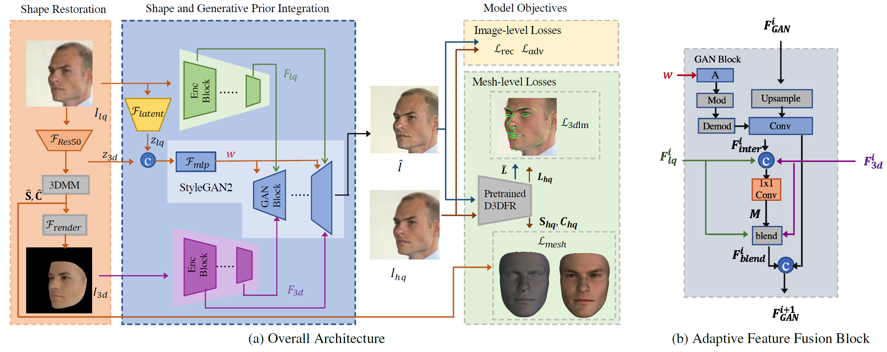
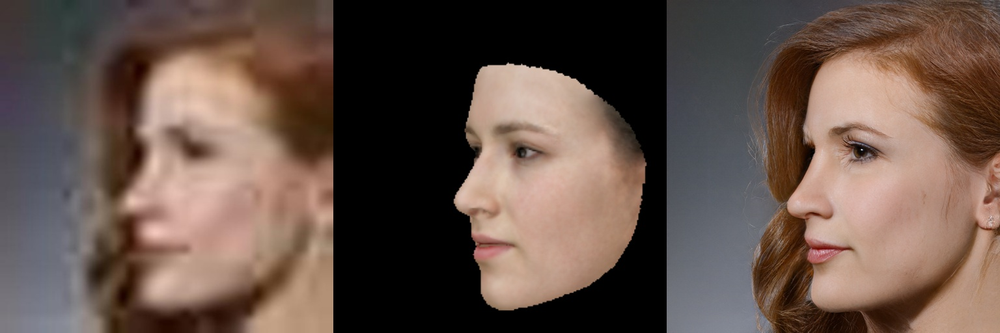
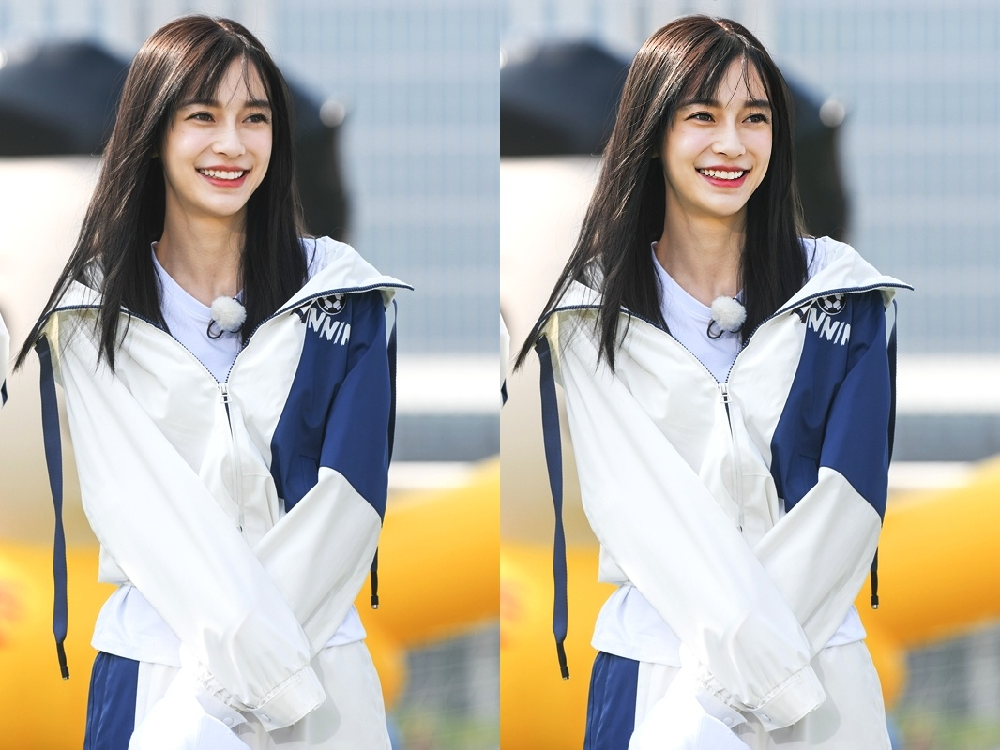

## Blind Face Restoration via Integrating Face Shape and Generative Priors (SGPN)<br><sub>Official PyTorch implementation of the CVPR 2022 paper</sub>



Abstract: *Blind face restoration, which aims to reconstruct high-quality images from low-quality inputs, can benefit many applications. Although existing generative-based methods achieve significant progress in producing high-quality images, they often fail to restore natural face shapes and high-fidelity facial details from severely-degraded inputs. In this work, we propose to integrate shape and generative priors to guide the challenging blind face restoration. Firstly, we set up a shape restoration module to recover reasonable facial geometry with 3D reconstruction. Secondly, a pretrained facial generator is adopted as decoder to generate photo-realistic high-resolution images. To ensure high-fidelity, hierarchical spatial features extracted from the low-quality inputs and rendered 3D images are inserted into the decoder with our proposed Adaptive Feature Fusion Block (AFFB). Moreover, we introduce hybrid-level losses to jointly train the shape and generative priors together with other network parts such that these two priors better adapt to our blind face restoration task. The proposed Shape and Generative Prior integrated Network (SGPN) can restore high-quality images with clear face shapes and realistic facial details. Experimental results on synthetic and real-world datasets demonstrate SGPN performs favorably against state-of-the-art blind face restoration methods.*

## Update

(2022-07-01) Update inference demo for SGPN.

## Usage

- prepare environment(We recommend Linux for performance and compatibility reasons)

```shell
cd sgpn
conda env create -f environment.yml
conda activate sgpn

# install pytorch3d(https://github.com/facebookresearch/pytorch3d/blob/main/INSTALL.md)
conda install -c fvcore -c iopath -c conda-forge fvcore iopath
conda install pytorch3d -c pytorch3d
```

- download pretrained weights([google drive](https://drive.google.com/file/d/14GsUEJHJxDpJSiZRFB0Eo9oGcshcI6a3/view?usp=sharing)) and put them into [checkpoints/]((./checkpoints/))


- restore cropped face images



```shell
python demo_face_restoration.py --src_path examples/test_crop/ --res_path examples/restoration/
```

- restore real images



```shell
python demo_face_restoration.py --src_path examples/test/ --res_path examples/restoration/ --real_image
```


## Citation
If our work is useful for your research, please consider citing:
```
@inproceedings{Zhu2022SGPN,
  author = {Feida Zhu, Junwei Zhu, Wenqing Chu, Xinyi Zhang, Xiaozhong Ji, Chengjie Wang, and Ying Tai},
  title = {Blind Face Restoration via Integrating Face Shape and Generative Priors},
  booktitle = {CVPR},
  year = {2022}
}
```

## Acknowledgments
We borrow some codes from [yolov5-face](https://github.com/deepcam-cn/yolov5-face), [D3DFR](https://github.com/sicxu/Deep3DFaceRecon_pytorch), [stylegan2-pytorch](https://github.com/rosinality/stylegan2-pytorch), [GPEN](https://github.com/yangxy/GPEN).

## Contact
If you have any questions, please contact the paper authors.